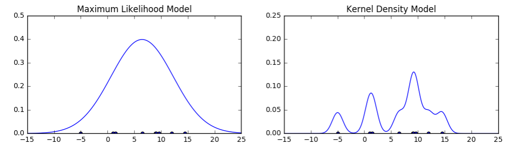
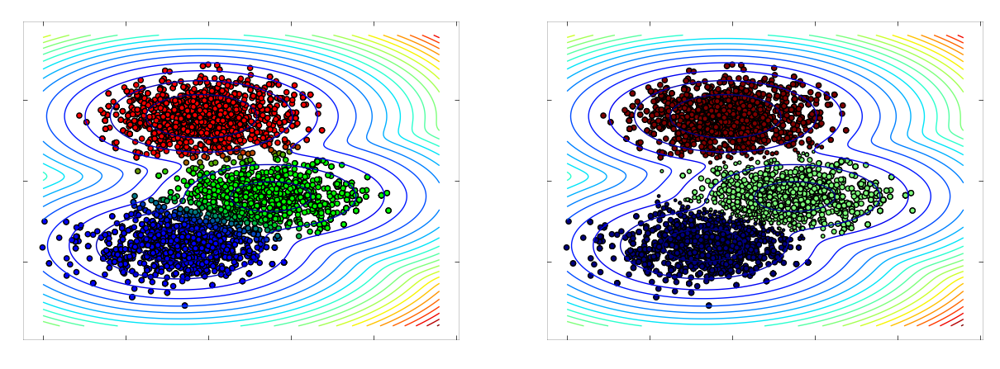
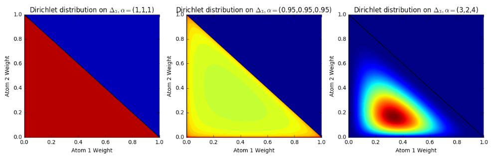

# questing-points
<h2>Reference and exhibition of solving data science problems with statistical methods</h2>
<h3> Overview </h3>
<b> Languages Used </b>
<ul><li>Python</li><li>R</li><li>Mathematica</li><li>SQL</li></ul>
<b> Statistical Techniques/Concepts </b>
<ul><li> Bayesian Parametric and Nonparametric inference
<ul><li> Bayesian Inference (prior/posterior/likelihood)</li><li>Parametric/Non-parametric </li> 
  <li> Clustering (k-means with different metrics/GMM/Dirichlet)</li>
  <li> PDF sampling/estimation using Monte-Carlo Markov Chain methods (Metropolis-Hastings)</li>
  <li> Gaussian Mixture Models (GMM)</li>
  <li> Akaike/Bayesian Information Criterion (AIC/BIC) </li> </ul></li>
  
  <li> Computational Methods for Numerical Analysis
  <ul><li> Zero-finding Methods : Bisection, Fixed Point, Newtons, Regula Falsi, Secant Method </li>
    <li> Minimum-finding Methods: Golden Search</li>
    <li> Derivative-calculating Methods: Lagrange Interpolation, Richardson Extrapolation </li>
    <li> Integral-calculating Methods: Trapezoid/Simpson's/Simpson's 3/8ths/ Rondberg </li></ul>

<b>Data Visualization </b>
<ul><li>matplotlib<ul><li>Scatterplots (custom size, coloring)</li><li>Contour Plots (surface, lines)</li><li>Histogram, PDF(2D/3D)</li></ul> </li></ul>

<b> Preview </b> 

